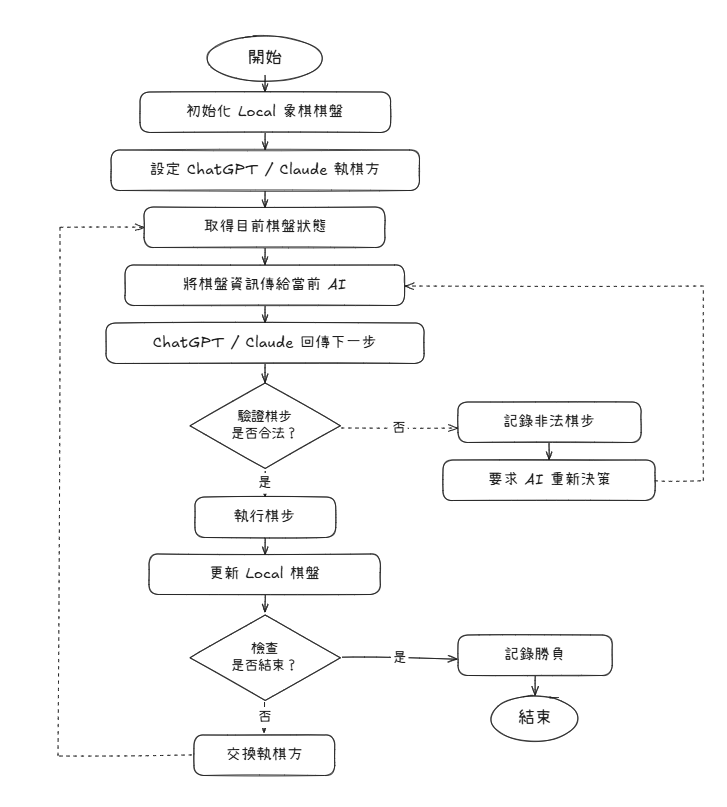

# AI Chinese Chess Arena

讓多個 AI 模型互相對弈中國象棋，收集統計數據，比較各模型的棋力、合法走步率與棋風差異。

## Arena Models

| Model | Provider |
|-------|----------|
| GPT-6 | OpenAI |
| Gemini 3.8 Flash | Google |
| Claude Opus 5.1 | Anthropic |

## 實驗設計

### 錦標賽結構

- 3 個模型，C(3,2) = 3 對組合
- 每對打 10 場（紅黑各 5 場）
- 總共 30 場對局

### 棋盤表示（給 AI 的輸入）

**ASCII 棋盤 + 合法走步列表**（不直接給 FEN，避免 AI 幻覺）：

```
  a  b  c  d  e  f  g  h  i
9 車 馬 象 士 將 士 象 馬 車
8 ．．．．．．．．．
7 ．砲．．．．．砲．
6 卒．卒．卒．卒．卒
5 ．．．．．．．．．
4 ．．．．．．．．．
3 兵．兵．兵．兵．兵
2 ．炮．．．．．炮．
1 ．．．．．．．．．
0 俥 傌 相 仕 帥 仕 相 傌 俥

你是紅方（下方）。
合法走步: a3a4, c3c4, e3e4, b0c2, b2b5, ...
```

### AI 回傳格式

```json
{
  "thinking": "對方炮瞄準中路，我先出馬護中...",
  "move": "b0c2"
}
```

- `move`：ICCS 座標（如 `b0c2` = b0 的馬跳到 c2）
- `thinking`：推理過程，用於棋風分析

### 非法走步處理

- 不在合法列表中 → 記錄 → 要求重新決策
- 最多重試 3 次，超過判負

## 統計指標

| 指標 | 說明 |
|------|------|
| 勝率矩陣 | 每對模型之間的勝/負/和 |
| 總積分排名 | 勝場數排序 |
| 合法走步率 | `合法次數 / 總嘗試次數`（per model） |
| 棋風差異 | 分析 thinking + 開局選擇 + 吃子率 + 攻守傾向 |

## How to Use

### 1. Install

```bash
pip install -r requirements.txt
```

### 2. Set API Keys

```bash
export OPENAI_API_KEY="sk-..."
export GOOGLE_API_KEY="..."
export ANTHROPIC_API_KEY="sk-ant-..."
```

### 3. Run

**CLI 模式**（純終端）：
```bash
python main.py
```

**Web Live View**（瀏覽器即時觀戰）：
```bash
python server.py
```
開啟 http://localhost:5000，點 Start Tournament 開始。可即時看到：
- 棋盤動態更新（含最後一步高亮）
- 每步 AI 的 thinking 過程
- 非法走步提示
- 對局歷史與統計
- 錦標賽結束後自動彈出完整報告

結果會輸出到 `results/` 目錄：
- `raw_results.json` — 完整對局數據（每步 thinking、非法嘗試、FEN）
- `report.md` — 統計報告（勝率矩陣、合法率、棋風分析）

### 4. Config

在 `config.py` 可調整：
- `MODELS` — 增減參賽模型
- `GAMES_PER_PAIR` — 每對打幾場（預設 10）
- `MAX_RETRIES` — 非法走步重試上限（預設 3）

## Tech Stack

- Python
- [`xiangqi`](https://pypi.org/project/xiangqi/) — 中國象棋規則引擎
- OpenAI / Google / Anthropic API
- Flask + Socket.IO — Web Live View

## 流程圖


